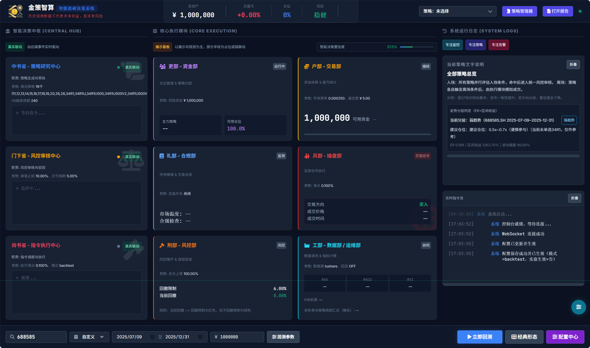
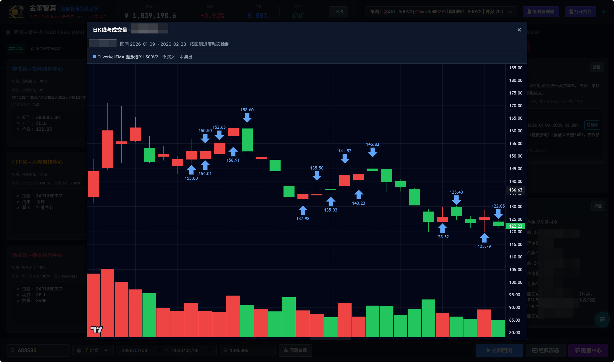
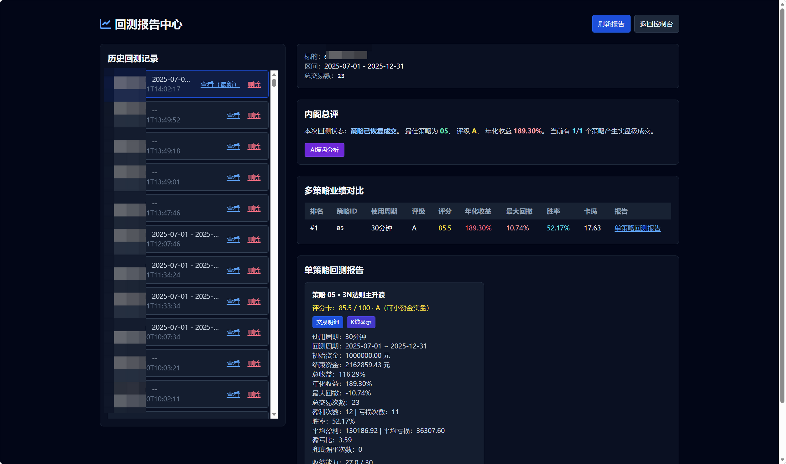
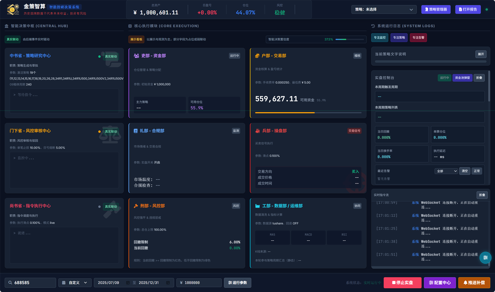
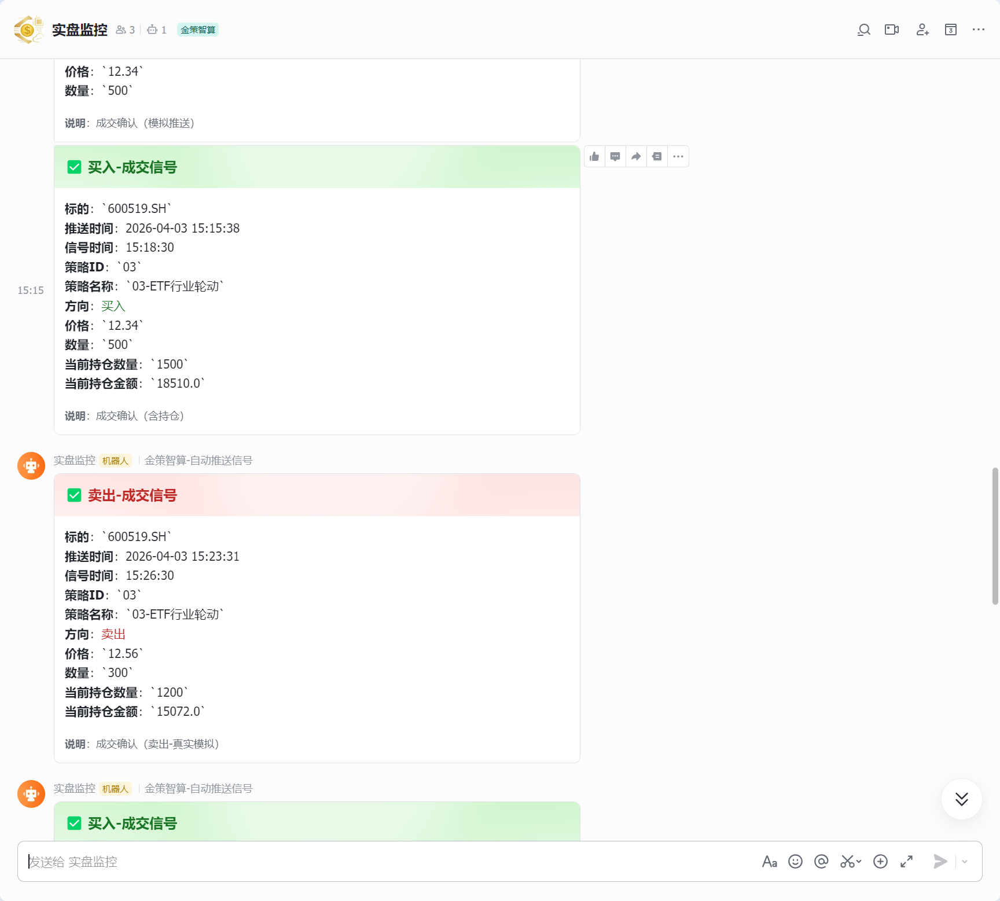
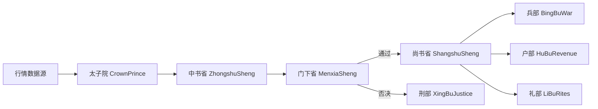

<div align="center">
  
  <h1>金策智算 · 智能投研决策系统</h1>
  <p>基于唐朝的三省六部制度建立的量化系统，分权协同、风控闭环、强化回测与执行。</p>
</div>

<p align="center">
  
  
  
  
  
</p>

## 目录

- [项目简介](#项目简介)
- [免责声明与用户使用协议](#免责声明与用户使用协议)
- [核心特性](#核心特性)
- [架构设计](#架构设计)
- [项目结构](#项目结构)
- [快速开始](#快速开始)
- [新增能力快速上手（TDX/BLK/组合回测）](#新增能力快速上手tdxblk组合回测)
- [数据准备](#数据准备)
- [数据源与使用条件](#数据源与使用条件)
- [全局回测与实盘监控模板](#全局回测与实盘监控模板)
- [安全基线](#安全基线)
- [已知限制](#已知限制)
- [Roadmap](#roadmap)
- [贡献指南](#贡献指南)

## 项目简介

本项目采用“三省六部”思想构建量化系统，把**策略生成、风控审核、执行清算**分层解耦，支持A股以下核心场景：

- 历史回测与报告输出
- 实盘监控与风控拦截
- 多策略统一管理（内置 + 自定义）
- Web 面板配置与任务控制


## 核心特性

- 多策略并行：内置策略与用户策略统一纳管
- 风控优先：门下省一票否决机制，覆盖止损、回撤、仓位约束
- 回测闭环：从数据获取、信号执行到结果分析全链路打通
- 数据源可切换：AkShare / Tushare / 默认 API / MySQL / PostgreSQL
- 可视化运维：`server.py + dashboard.html` 提供操作面板

### 回测模式

#### 回测k线信号标记与回测报告



### 实盘模式与信号推送




## 架构设计(智能体智能）

### 三省（决策主链路）

- 太子院：数据前置校验与分发
- 中书省：策略信号生成
- 门下省：风控审核与拦截
- 尚书省：执行调度与资金清算

### 六部（职能部门）

- 吏部：策略注册与生命周期管理
- 户部：现金、成本、净值核算
- 礼部：业绩报表与策略排行
- 兵部：撮合执行与交易管理
- 刑部：违规记录与风险事件
- 工部：行情清洗与指标计算

### 流程图



## 项目结构

```text
.
├─src/
│  ├─core/            # 三省核心流程
│  ├─ministries/      # 六部职能实现
│  ├─strategies/      # 内置与自定义策略管理
│  ├─strategy_intent/ # 策略意图解析与生成
│  └─utils/           # 配置、指标、数据源封装
├─data/               # 历史数据、策略库、报告数据
├─dashboard.html      # Web 面板
├─server.py           # FastAPI 服务入口
├─main.py             # 回测入口
├─run_live.py         # 实盘监控入口
└─run_backtest.py     # 命令行回测入口
```

**项目答疑咨询** 
- 星球内容
  - 金策智算安装、部署、配置一站式教程
  - 三省六部架构设计思路与源码解读
  - 日常技术答疑、BUG 排查
- 定位：纯技术研究、工具学习、代码交流
  - 不荐股、不指导买卖、不承诺收益、不涉及任何投资建议。
  - 适合人群：量化爱好者、Python 开发者、想自建量化研究工具的学习者。
- 新用户优惠券，100张，领完即止

<p align="center">
  
  
   
</p>

## 快速开始

### 1. 环境要求

- Python 3.8+
- 建议使用虚拟环境

### 2. 安装依赖

```bash
pip install -r requirements.txt
pip install tushare akshare fastapi uvicorn
```

### 3. 配置说明

- 主配置：`config.json`
- 本地覆盖配置：`config.private.json`（可选）

系统会先加载 `config.json`，再自动用 `config.private.json` 进行覆盖。

`config.private.json` 示例：

```json
{
  "data_provider": {
    "tushare_token": "your_token",
    "default_api_key": "your_api_key",
    "llm_api_key": "your_llm_key",
    "strategy_llm_api_key": "your_strategy_llm_key"
  }
}
```

维护方式说明：

- 推荐直接维护 `config.private.json`，便于版本隔离与本地管理。
- 也可以在前端配置中心维护密钥字段，效果等价。
- 当前系统已实现“保存分流”：前端保存时普通配置写入 `config.json`，密钥字段写入 `config.private.json`。
- 若本地不存在 `config.private.json`，首次在前端保存密钥后会自动创建该文件。
- 自定义策略也支持“私有优先读取”：若存在 `data/strategies/custom_strategies.private.json`，系统会优先读取并写入该文件；否则回退到 `data/strategies/custom_strategies.json`。

推荐做法（多机器一致）：

- 建议将私有文件放到仓库外目录，例如：`D:\04.量化\private-data`
- 可直接在 `config.json` 中配置以下路径（无需每次敲命令）：
  - `system.private_config_path`
  - `system.private_strategy_path`
- 建议配置如下环境变量（每台机器各自设置一次）：
  - `CONFIG_PRIVATE_PATH=D:\04.量化\private-data\config.private.json`
  - `CUSTOM_STRATEGIES_PRIVATE_PATH=D:\04.量化\private-data\strategies\custom_strategies.private.json`
  - `CUSTOM_STRATEGIES_WRITE_PRIVATE=1`

PowerShell 示例：

```powershell
New-Item -ItemType Directory -Force -Path "D:\04.量化\private-data\strategies" | Out-Null
setx CONFIG_PRIVATE_PATH "D:\04.量化\private-data\config.private.json"
setx CUSTOM_STRATEGIES_PRIVATE_PATH "D:\04.量化\private-data\strategies\custom_strategies.private.json"
setx CUSTOM_STRATEGIES_WRITE_PRIVATE "1"
```

说明：

- 代码拉取到新机器后，不会自动带上私有文件，需要你自行放置到上述路径。
- 路径优先级：环境变量 > `config.json` 路径配置 > 项目默认路径。
- 新版 `server.py` 启动时会检查私有配置与私有策略路径，缺失会在日志中给出明确原因与修复建议。
- `config.private.json` 必须保存为 `UTF-8`（无 BOM）；若使用 `UTF-8 with BOM`，加载会失败并表现为 `default_api_key`、`tushare_token` 为空。

### 4. 启动方式

回测模式：

```bash
python main.py
```

命令行回测：

```bash
python run_backtest.py --stock 600036.SH --start 2025-01-01 --end 2025-12-31 --capital 1000000
```

实盘监控：

```bash
python run_live.py
```

启动 Web 面板（实际只需要启动server，剩下的都会启动）：

```bash
python server.py
```

命令行临时指定端口：

```bash
python server.py --prot 8001
```

可自定义启动地址与端口（优先级：环境变量 > `config.json`）：

```bash
$env:SERVER_HOST="0.0.0.0"
$env:SERVER_PORT="9000"
python server.py
```

也可在 `config.json` 的 `system.server_host`、`system.server_port` 中配置。

前台配置中心可以进行具体的配置


## 新增能力快速上手（TDX/BLK/组合回测）

本仓库已新增以下能力：

- 通达信公式转换：`POST /api/tdx/compile`
- 通达信公式一键入库：`POST /api/tdx/import_strategy`
- BLK 文件解析：`POST /api/blk/parse`
- 多策略组合回测：`/api/control/start_backtest` 支持 `combination_config`
- 批量任务编排：`scripts/batch_backtest_runner.py` 支持 BLK 导入标的池、公式包导入策略池

回测组合参数示例：

```json
{
  "stock_code": "600036.SH",
  "strategy_ids": ["01", "02", "03"],
  "combination_config": {
    "enabled": true,
    "mode": "vote",
    "weights": {"01": 2, "02": 1, "03": 1.5},
    "min_agree_count": 2,
    "tie_policy": "skip"
  },
  "start": "2024-01-01",
  "end": "2024-12-31"
}
```

批量脚本端到端示例：

```bash
python scripts/batch_backtest_runner.py ^
  --blk-file "D:/data/demo.blk" ^
  --formula-pack-json "D:/data/formula_pack.json" ^
  --run-after-import ^
  --generate-tasks --generate-mode replace --run-after-generate ^
  --coverage-check --coverage-hard-gate --run-after-coverage-check
```

完整说明文档见：

- [新功能说明_通达信_BLK_组合回测.md](./新功能说明_通达信_BLK_组合回测.md)

## 数据准备

- 本仓库默认不提供完整历史数据，`data/history/` 被 `.gitignore` 忽略，克隆后通常为空或仅少量样例。
- 若需完整回测数据，请联系仓库维护者。
- 如果你使用默认 API 数据源，系统会从 `data_provider.default_api_url` 拉取行情；若该服务不可用，回测将拿不到数据。
- 若你使用 Tushare/AkShare，可直接联网拉取，不依赖本地 `data/history` 全量文件。
- 历史差异同步功能依赖三项配置同时可用：`default_api_url`、`default_api_key`、`tushare_token`。

## 数据源与使用条件

| 数据源         | 配置项                                                                    | 使用条件                   | 典型用途         |
| ----------- | ---------------------------------------------------------------------- | ---------------------- | ------------ |
| default API | `data_provider.source=default` + `default_api_url` + `default_api_key` | 需要可访问的私有/自建行情服务        | 统一分钟线、批量回测   |
| Tushare     | `data_provider.source=tushare` + `tushare_token`                       | 需要 Tushare Token 与网络连通 | 标准化行情获取、历史补数 |
| AkShare     | `data_provider.source=akshare`                                         | 通常无需 Token，但依赖网络与上游可用性 | 快速验证、轻量使用    |
| MySQL       | `data_provider.source=mysql` + `mysql_*` 配置                           | 需安装 `pymysql` 并可直连 MySQL | 本地库直读、低延迟回测 |
| PostgreSQL  | `data_provider.source=postgresql` + `postgres_*` 配置                   | 需安装 `psycopg2-binary` 并可直连 PostgreSQL | 本地库直读、低延迟回测 |

说明：

- 实盘入口 `run_live.py` 支持 `TUSHARE_TOKEN` 环境变量覆盖配置文件。
- 未提供 Tushare Token 且选择 tushare 时，会自动回退到 akshare。
- MySQL 直连默认读取表：`dat_1mins/dat_5mins/dat_10mins/dat_15mins/dat_30mins/dat_60mins/dat_day`，可在 `config.json` 覆盖。
- MySQL 支持连接池与分页批量读取：`mysql_pool_size`、`mysql_pool_wait_timeout_sec`、`mysql_query_page_size`，用于大区间回测提速。
- PostgreSQL 直连默认读取表：`dat_1mins/dat_5mins/dat_10mins/dat_15mins/dat_30mins/dat_60mins/dat_day`，可在 `config.json` 覆盖。
- PostgreSQL 支持连接池与分页批量读取：`postgres_pool_size`、`postgres_pool_wait_timeout_sec`、`postgres_query_page_size`，用于大区间回测提速。
- 回测支持将分钟K线缓存落库到数据库：`data_provider.backtest_cache_db_source` 可设为 `mysql` 或 `postgresql`。
- 增量同步支持两种写入模式：`history_sync.write_mode=api`（写入 `default_api_url` 对应服务）或 `history_sync.write_mode=direct_db`（直连 `mysql/postgresql`）。
- 直连数据库模式下，目标库由 `history_sync.direct_db_source` 指定，可选 `mysql` / `postgresql`。
- PostgreSQL 落库使用 `ON CONFLICT (code, trade_time)`，目标表需具备 `(code, trade_time)` 唯一约束。
- MySQL 落库使用 `ON DUPLICATE KEY UPDATE`，目标表需具备可触发冲突更新的唯一键（建议 `(code, trade_time)`）。
- 增量同步时间窗口新增两种模式：`history_sync.time_mode=lookback`（按 `lookback_days` 回看最近 N 天）与 `history_sync.time_mode=custom`（使用 `custom_start_time/custom_end_time` 固定区间）。
- 当请求或配置中显式传入 `start_time/end_time` 时，优先使用显式时间，`time_mode` 仅在未显式传时间时生效。
- `history_sync.intraday_mode=true` 时，未显式传时间将使用“当日（或最近交易日）09:30:00~15:00:00”窗口；默认建议关闭，仅在盘中补数场景启用。
- `history_sync.session_only=true`（默认）时，分钟线源数据会过滤为交易时段 `09:30:00~15:00:00`，避免写入非交易分钟。

#### 增量同步时间配置示例

```json
"history_sync": {
  "time_mode": "lookback",
  "lookback_days": 20,
  "custom_start_time": "",
  "custom_end_time": "",
  "session_only": true,
  "intraday_mode": false
}
```

- 最近 N 天模式：`time_mode=lookback` + `lookback_days=N`
- 自定义区间模式：`time_mode=custom` + `custom_start_time=YYYY-MM-DD HH:MM:SS` + `custom_end_time=YYYY-MM-DD HH:MM:SS`
- API `/api/history_sync/run` 与 `/api/history_sync/scheduler/start` 同步支持上述字段：`time_mode/custom_start_time/custom_end_time/session_only/intraday_mode`

#### 自定义开始/结束时间窗模板写法

- 固定格式：`YYYY-MM-DD HH:MM:SS`
- 推荐边界：开始时间写 `09:30:00`，结束时间写 `15:00:00`
- 生效前提：`time_mode` 必须是 `custom`
- 优先级：若同时传了 `start_time/end_time`，则以 `start_time/end_time` 为准

```json
"history_sync": {
  "time_mode": "custom",
  "custom_start_time": "2026-03-01 09:30:00",
  "custom_end_time": "2026-03-31 15:00:00",
  "session_only": true,
  "intraday_mode": false
}
```

接口请求体模板：

```json
{
  "time_mode": "custom",
  "custom_start_time": "2026-03-01 09:30:00",
  "custom_end_time": "2026-03-31 15:00:00",
  "session_only": true,
  "intraday_mode": false
}
```

#### 历史数据源表结构参照

- MySQL 建表参考：项目根目录 `历史数据源表结构.sql`。
- 该脚本已包含分钟/日线表及 `uk_code_trade_time(code, trade_time)` 唯一索引定义，可直接用于 MySQL 初始化。
- PostgreSQL 可按同名表结构迁移，并确保存在唯一约束 `(code, trade_time)`，以兼容缓存落库的 upsert 语义。

## 全局回测与实盘监控模板

- 全局默认参数、策略映射规则、实盘告警阈值模板见：[全局回测与实盘监控基线模板.md](./全局回测与实盘监控基线模板.md)
- 建议先按模板完成统一口径配置，再接入回测与实盘链路
- 默认数据源建议固定为 `default`，避免回测中途切换
- 建议采用“回测 -> 模拟盘 -> 小资金实盘”分级准入

## 安全基线

- 禁止将 Token / Key 写入 `config.json`
- 统一将密钥写入 `config.private.json` 或环境变量
- `.gitignore` 已忽略 `config.private.json` 与 `.env*`
- Web 面板中的密钥字段已改为密码框显示
- 配置保存会分流：普通配置写入 `config.json`，密钥字段写入 `config.private.json`
- 后端 `/api/config` 返回的密钥字段为脱敏值，请勿在公网暴露未鉴权服务

## 已知限制

- `main.py` 的回测时间区间默认写死在代码内（2024-01-01 到 2025-12-31），开箱即用但灵活性有限。
- 数据源切换依赖配置正确性，配置缺失时会出现“无有效数据，回测终止”。
- 仪表盘密钥字段为密码框，仅提供前端遮挡，不等同于后端鉴权与传输加密能力。
- 当前仓库未内置 CI 自动检查流程，提交前建议自行执行核心脚本与测试。

## Roadmap

- [x] 三省六部核心交易链路
- [x] 回测 + 实盘双模式
- [x] 策略管理与自定义策略存储
- [x] Web 配置与任务控制面板
- [ ] 更完善的 CI（测试、格式检查、发布流程）
- [ ] 更多标准化样例策略与基准报告

## 授权说明

本项目采用 **“个人非商业免费 + 商业需授权”** 模式。

**免费使用范围（非商业）**
- 个人学习
- 学术研究
- 本地自用（不对外提供商业服务）

**以下行为必须事先取得作者书面商业授权**
- 售卖本项目或衍生版本
- 托管服务、SaaS、云端收费服务
- 二次包装后销售、分销、代理
- 任何直接或间接盈利部署

**商业授权联系**
- 联系方式：`zthx410@163.com`
- 说明：商业授权范围、费用与支持条款以双方签署协议为准。


**免责声明**
## 免责声明与用户使用协议

### 重要提示

本软件及配套程序、数据、策略代码、回测引擎（统称“本工具”）为开源量化研究与历史数据回测工具，仅面向金融知识学习、策略逻辑验证、量化技术研究用途，不构成任何投资建议。

#### 一、工具性质声明

1. 本工具仅提供历史行情数据展示、统计计算、策略回测、代码调试、技术分析研究功能。  
2. 本工具不提供任何证券买卖点位推荐、不推荐具体股票/基金/期货等标的、不预测价格走势、不提供投资决策依据。  
3. 本工具不属于荐股软件、不属于投资咨询软件、不属于智能交易决策软件。  

#### 二、风险提示

1. 证券、期货、基金等投资行为存在高风险，历史回测结果不代表未来收益，不代表策略有效性。  
2. 任何基于本工具生成的回测报告、指标结果、信号图表、策略参数，均不能作为实盘交易依据。  
3. 用户因使用本工具进行实盘交易所产生的任何盈利、亏损、纠纷、损失、民事赔偿、行政处罚、刑事责任，均由用户自行承担全部责任。  

#### 三、开发者责任免除（含民宿、茶馆、线下场所）

1. 本工具开发者（金策智算及相关主体）不具备证券投资咨询业务资质，不对外开展证券投资咨询活动，不提供任何形式的投资建议。  
2. 开发者不对任何第三方使用本工具的行为承担法律责任，包括但不限于：  
   - 个人用户、机构用户、散户社群  
   - 茶馆、会所、股民交流场所、线下投研空间  
   - 民宿、酒店、公寓、出租屋等住宿经营场所  
   - 经销商、合作方、代理商、推广渠道  
   - 任何商业或非商业场所、平台、社群  
3. 上述第三方（含民宿、茶馆等）以“金策智算”名义开展的收费荐股、投资指导、收益承诺、会员费、分成、代客理财、直播分析、线下教学等经营活动，均属其独立行为；开发者不知情、不授权、不参与、不控制、不获益、不承担任何连带责任（包括民事赔偿、行政处罚、刑事责任）。  
4. 本工具为开源发布，开发者不对软件稳定性、连续性、安全性做出任何承诺，因软件使用导致的数据丢失、设备故障、系统异常、经济损失等问题，开发者不承担任何法律责任。  

#### 四、用户义务与承诺

用户使用本工具即视为已充分理解并承诺：

1. 已明确知晓本工具仅为量化学习与研究用途，不用于任何非法证券活动、违规荐股、收费投资指导、代客理财。  
2. 具备相应金融投资风险识别能力与承受能力，自愿承担所有使用风险与法律责任。  
3. 不利用本工具从事违反《证券法》《期货交易管理条例》《证券投资咨询业务管理暂行规定》等法律法规的活动。  
4. 知晓并同意：开发者不对任何用户或第三方（含民宿、茶馆、线下场所等）的盈亏、纠纷、民事索赔、行政处罚、刑事责任承担任何责任。  

#### 五、最终解释与法律适用

1. 本声明为开源软件使用条件，构成用户使用本工具的前提。  
2. 因本工具产生的争议，适用中华人民共和国法律管辖。  

> 详细条款请见仓库根目录 `LICENSE` 文件；如与商业协议冲突，以商业协议为准。


## 贡献指南

欢迎提交 Issue 和 PR。建议流程：

1. Fork 项目并创建功能分支
2. 保持提交粒度清晰，说明改动动机
3. 提交前确保核心脚本可运行
4. 通过 PR 描述测试方法与影响范围

## Star History
[](https://star-history.com/#ScottZt/jin-ce-zhi-suan&Date)
